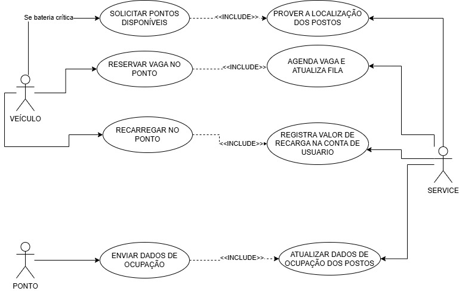

## Sistema de Recarga de Carros Elétricos Inteligente

 Este projeto visa criar o protótipo inicial de ma infraestrutura capaz de otimizar o uso dos pontos de recarga, indicar aos motoristas os locais mais adequados com base na distância e disponibilidade, permitir reservas, realizar liberações automáticas após o carregamento e registrar os dados para posterior pagamento. O sistema que promove uma comunicação inteligente, padronizada e em tempo real entre os veículos, nuvem e pontos de recarga. 

## Sumário

- [Introdução](#introdução)
- [Fundamentos Teóricos](#fundamentos-teóricos)
- [Arquitetura do Sistema](#arquitetura-do-sistema)
- [Protocolo de Comunicação](#protocolo-de-comunicação)
- [Fluxo de Comunicação](#fluxo-de-comunicação)
- [Gerenciamento de Concorrência](#gerenciamento-de-concorrência)
- [Como Executar](#como-executar)
- [Conclusão](#conclusão)
- [Referências](#referências)

## Introdução

A transformação digital e a mobilidade inteligente estão mudando a forma como nos comunicamos e nos deslocamos. Neste contexto, este relatório apresenta o desenvolvimento de um protótipo de sistema cliente-servidor em nuvem, realizado como parte do projeto de PBL (Problem-Based Learning) na disciplina de Concorrência e Conectividade. O objetivo central foi criar uma solução de comunicação inteligente, padronizada e em tempo real entre veículos elétricos, pontos de recarga e a nuvem, utilizando o protocolo TCP/IP. A proposta visa oferecer uma infraestrutura capaz de otimizar o uso dos pontos de recarga, indicar aos motoristas os locais mais adequados com base na distância e disponibilidade, permitir reservas, realizar liberações automáticas após o carregamento e registrar os dados para posterior pagamento. O desenvolvimento do sistema envolveu uma abordagem prática e multidisciplinar, combinando conceitos de redes de computadores, programação com a linguagem Go e uso de contêineres Docker para simular o ambiente de operação. Durante o processo, foram enfrentados desafios técnicos que exigiram soluções criativas e foco em escalabilidade. O resultado é um protótipo funcional que simula uma rede de recarga eficiente e conectada, contribuindo para reduzir filas e melhorar a experiência dos usuários de veículos elétricos. 

## Fundamentos Teóricos

- **Linguagem GoLang**
A linguagem Go foi escolhida por ser simples, leve e eficiente para aplicações concorrentes e distribuídas. Suas goroutines facilitam o paralelismo, essencial para lidar com múltiplos veículos e pontos de recarga. Go também oferece boa integração com sockets TCP/IP, permitindo comunicação direta entre os componentes. Além disso, seus binários compactos funcionam bem com Docker, simplificando a criação e execução dos containers do sistema.

- **Docker**
Docker foi usado para simular uma arquitetura distribuída com múltiplas instâncias isoladas (veículo, nuvem e ponto), o que facilitou o desenvolvimento, testes e execução do sistema. Os containers, por serem leves e rápidos, permitiram rodar cada componente separadamente, com fidelidade ao comportamento real. As imagens Docker, criadas a partir de Dockerfiles, garantem que o ambiente de execução seja sempre o mesmo. No projeto, foram criadas três imagens: servidor, ponto e veículo.

- **Comunicação TCP/IP e Socket**
A comunicação entre os componentes do sistema foi feita com sockets TCP nativos em Go, que garantem trocas de dados confiáveis e em tempo real. Sockets de servidor esperam conexões e os de cliente as iniciam. Essa estrutura permitiu a integração eficiente entre veículos, pontos de recarga e a nuvem, usando IPs e portas para manter a conexão.

## Arquitetura do Sistema

  

A arquitetura do sistema foi projetada com base no modelo cliente-servidor, utilizando a linguagem Go e containers Docker para isolar e simular os diferentes componentes: veículos, pontos de recarga e o servidor em nuvem. 

- *Componentes do Sistema:*
    - ***Sevidor***
    O servidor é o núcleo do sistema, responsável por coordenar a comunicação entre veículos e pontos de recarga. Ele processa pedidos de recarga com base na função analiseTodosPontos(), define o ponto ideal, gerencia filas e reservas, e recebe atualizações dos pontos. Cada cliente é tratado de forma concorrente com goroutines, e sua lógica principal está nos arquivos server.go e handlers.go.

    - ***Veículo***
    Os veículos simulam carros elétricos e atuam como clientes do sistema. Cada um se conecta ao servidor via TCP, envia suas coordenadas (geradas por sorteiaCoordenadas.go) e solicita orientação para recarga. A lógica está no arquivo veiculo.go, que gerencia a conexão e o intercâmbio de dados com o servidor.

    - ***Ponto de Recarga***
    Os pontos de recarga são clientes que se conectam ao servidor para reportar o estado da fila, avisar sobre a finalização de carregamentos e receber atualizações. Toda a lógica está concentrada em ponto.go.

## Protocolo de Comunicação

O sistema utiliza um protocolo de comunicação baseado em mensagens de texto simples via **TCP**, trocadas entre veículos elétricos e pontos de recarga. Cada mensagem segue um formato específico para identificação, autenticação e troca de dados relevantes sobre localização e status da recarga.

### Conexão Inicial

- **Veículo**: Ao conectar, o cliente envia a mensagem `VEICULO CONECTADO`, identificando-se como um veículo.
- **Ponto de Recarga**: Envia `PONTO DE RECARGA CONECTADO` para se identificar como ponto de recarga.

### Comunicação com Veículos

1. **Identificação e Localização**:
   - Mensagem no formato: `VEICULO | <placa> | <latitude> | <longitude>`
   - O servidor registra a placa e localiza o ponto de recarga mais próximo.

2. **Sugestão de Ponto**:
   - Se não houver fila no ponto mais próximo, o servidor sugere esse ponto diretamente.
   - Caso haja fila, é feita uma análise para encontrar o melhor ponto considerando localização e nível de bateria.

3. **Resposta do Veículo**:
   - O veículo responde com `VEICULO sim` para aceitar ou `VEICULO nao` para recusar a entrada na fila.
   - Em caso positivo, é adicionado à fila do ponto e o status da fila é atualizado para o ponto.

### Comunicação com Pontos de Recarga

- Após o término da recarga, o ponto envia uma mensagem no formato:
    PONTO: Veiculo <placa> finalizou recarga no Ponto <id>. Pagamento registrado.
- O servidor remove o veículo da fila do ponto informado.

### Observações Técnicas

- As mensagens são separadas por quebras de linha (`\n`).
- Cada conexão é tratada de forma contínua em uma sessão individual.
- A comunicação é síncrona e espera resposta para prosseguir com as ações, como o gerenciamento de filas.

## Fluxo de Comunicação 
Abaixo está descrito o fluxo de comunicação entre os componentes do sistema — servidor, veículos e pontos de recarga:

    1. **Início da Conexão do Servidor**

    O servidor é iniciado e escuta conexões TCP na porta 8080.

    Cada nova conexão aceita gera uma goroutine dedicada para tratá-la de forma concorrente, permitindo múltiplos acessos simultâneos ao sistema.

    2. **Conexão do Ponto de Recarga**
    O ponto de recarga se conecta ao servidor e tem sua conexão armazenada em uma lista de pontos ativos. Após a conexão, ele permanece aguardando atualizações do servidor sobre sua fila de reservas.

    3. **Conexão do Veículo**
    O veículo se conecta ao servidor e, ao detectar nível crítico de bateria, solicita o melhor ponto de recarga com base na distância e na situação atual das filas.

    4. **Análise e Proposta de Reserva**

    O servidor recebe a solicitação do veículo e verifica:
        - Se o ponto mais próximo não possui fila, ele é sugerido diretamente ao veículo.
        - Caso contrário, o servidor executa analiseTodosPontos(), que avalia todos os pontos considerando:
            - Comprimento da fila;
            - Nível de bateria dos veículos em espera;
            - Distância até cada ponto.
    Em ambos os casos, o servidor pergunta ao veículo se deseja reservar o ponto sugerido.

    5. **Confirmação da Reserva**
    O veículo responde ao servidor, confirmando a reserva no ponto indicado. 
    Essa confirmação é tratada como um compromisso de entrada na fila.

    6. **Atualização da Fila**
    Assim que o veículo aceita a reserva, o servidor envia a fila atualizada ao respectivo ponto de recarga, garantindo que ele saiba exatamente quem está a caminho.

    7. **Finalização da Recarga**
    Após o processo de recarga, o ponto envia uma mensagem ao servidor sinalizando que o veículo concluiu a recarga. O servidor então remove o veículo da fila correspondente.

Este fluxo garante uma comunicação contínua, eficiente e coordenada entre todos os participantes do sistema.

## Gerenciamento de Concorrência

O projeto aproveita os recursos nativos de concorrência da linguagem Go para garantir desempenho e escalabilidade. Cada nova conexão estabelecida com o servidor — seja de um veículo ou de um ponto de recarga — é processada de forma independente por meio de *goroutines*, permitindo que múltiplas comunicações ocorram simultaneamente sem bloqueios.
Essa arquitetura concorrente assegura respostas em tempo real, mesmo sob alta carga de conexões paralelas.

- **Controle de Acesso a Recursos Compartilhados**

Para gerenciar o acesso seguro a estruturas de dados compartilhadas (como listas de conexões e arquivos JSON que representam filas), o sistema utiliza ***mutexes***. Com isso, seções críticas do código são protegidas contra condições de corrida, evitando comportamentos indesejados durante modificações simultâneas por diferentes goroutines.
Essa abordagem garante integridade dos dados e robustez na operação do sistema distribuído.

## Como Executar

    1. Para buildar as imagens do projeto use:
        docker-compose build  
    2. Para criar os containers sem iniciar:
        docker-compose create 
    Obs. Use o comando: docker ps -a para verifica os containers criados;
    3. Para executar os containers, primeiro execute o service usando: 
        docker-compose start server
    4. Inicie os pontos executando o comando:
        docker-compose start ponto ponto2 ponto3 ponto4 ponto5
    5. Verifique sempre os logs usando: 
        docker logs server
    6. Entre no terminal interativo dos veiculos: 
        docker start -ai veiculo 

OBS. Para tornar o processo mais fácil, execute os SCRIPTS

## Conclusão

O projeto atingiu todos os objetivos, demonstrando a viabilidade de um sistema cliente-servidor em Go com comunicação em tempo real entre veículos, pontos de recarga e servidor. O uso de goroutines e Docker contribuiu para desempenho e portabilidade. Além de cumprir os requisitos, o sistema mostrou potencial para aplicações em mobilidade elétrica. Trabalhos futuros podem incluir balanceamento de carga, autenticação, algoritmos de roteamento mais eficientes e integração com sensores e dados em tempo real.

## Equipe
<table>
  <tr>
    <td align="center"> <b> Helena Filemon </b></a> 👨‍💻</a></td>
    <td align="center"> <b> Sara Souza </b></a> 👨‍💻</a></td>
  </tr>
</table>

## Referências
Docker Documentation. (2024). Docker Docs. Disponível em: https://docs.docker.com/
Donovan, A. A., & Kernighan, B. W. (2016). The Go Programming Language. Addison-Wesley Professional.
Go Documentation. (2024). The Go Programming Language Specification. Disponível em: https://golang.org/doc/
Hüttermann, M. (2012). DevOps for Developers. Apress.
Merkel, D. (2014). Docker: lightweight Linux containers for consistent development and deployment. Linux Journal, 2014(239), 2.
Tanenbaum, A. S., & Wetherall, D. J. (2011). Redes de Computadores (5ª ed.). Pearson.
